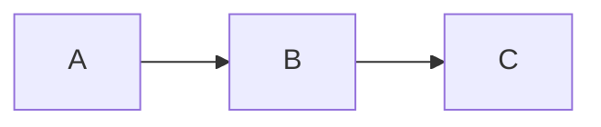

# template-docs

MkDocs template for ICIQ-DMP project documentation.  
Fork this repo to create `PROJECT-docs` for any ICIQ project.

## Forking checklist

1. Fork this repo to `iciq-dmp/PROJECT-docs`.
2. In `properdocs.yml`, update the **PROJECT-SPECIFIC** block at the top:
   - `site_name`, `site_url`, `repo_url`, `repo_name`
   - `extra.source_repo` — the GitHub repo containing the source code
   - `extra.project_name`
3. Edit `docs/index.md` with the project description.
4. Enable GitHub Pages in the repo settings (source: **GitHub Actions**).
5. Push to `main`/`master` — the `deploy-docs.yml` workflow will build and deploy.

## Structure

```
docs/
├── index.md            # Home page
├── tutorials/          # Learning-oriented content (write by hand)
├── how-to/             # Task-oriented content (write by hand)
├── reference/          # Auto-generated from source docstrings
├── explanation/        # Understanding-oriented content (write by hand)
└── gen_ref_pages.py    # mkdocs-gen-files script for reference generation
properdocs.yml
requirements.txt
.github/workflows/
├── deploy-docs.yml         # Build + deploy to GitHub Pages
└── sync-from-template.yml  # PR from template-docs when it changes
```

## Syncing template changes

Run the `sync-from-template` workflow manually (or let it run on its Monday
schedule) to get a PR with the latest common changes from `template-docs`.
Resolve any conflicts in the project-specific block of `properdocs.yml`.

## Local development

**With Docker (recommended):**

```bash
git clone https://github.com/iciq-dmp/PROJECT_NAME source
docker compose up
```

Open <http://localhost:8000>.

**Without Docker:**

```bash
pip install -r requirements.txt
git clone https://github.com/iciq-dmp/PROJECT_NAME source
properdocs serve
```

## Theme overrides

Place custom Jinja2 templates in `docs/overrides/` to extend or replace
Material for MkDocs partials. `docs/overrides/main.html` is included as a
starting point — it simply extends the base template.

## Mermaid diagrams

Use fenced code blocks tagged `mermaid`:

````markdown

````

## Redirects

To redirect a moved page, add entries to the `redirects.redirect_maps` block in
`properdocs.yml`:

```yaml
plugins:
  - redirects:
      redirect_maps:
        'old/page.md': 'new/page.md'
```
