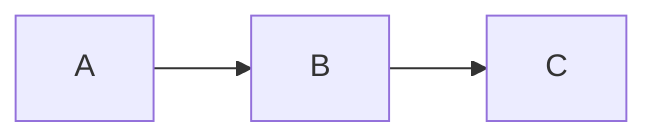

# docs-template

ProperDocs base repo for ICIQ-DMP project documentation.  
This repo is a GitHub **template repository** — create `PROJECT-docs` from
it using **"Use this template" → "Create a new repository"** on GitHub, not
"Fork" (see "Which one: template or fork?" below for why that distinction
matters).

## New-project checklist

1. On [this repo's GitHub page](https://github.com/ICIQ-DMP/docs-template),
   click **"Use this template" → "Create a new repository"**, owned by
   `ICIQ-DMP`, named `PROJECT-docs`.
2. In `properdocs.yml`, update the **PROJECT-SPECIFIC** block at the top:
   - `site_name`, `site_url`, `repo_url`, `repo_name`
   - `extra.source_repo` — the GitHub repo containing the source code
   - `extra.project_name`
3. Edit `docs/index.md` with the project description.
4. Enable GitHub Pages in the repo settings (source: **GitHub Actions**) —
   or call `POST /repos/ICIQ-DMP/PROJECT-docs/pages` with
   `{"build_type": "workflow"}`, which does the same thing.
5. Push to `main`/`master` — the `docs.yml` workflow will build, lint and
   deploy.

## Which one: template or fork?

**Use "Use this template" (recommended).** The new repo is fully
independent — no relationship to this repo at all — so its GitHub Actions
run immediately, with no extra step. The trade-off: there's no "Sync fork"
button to pull in template fixes later; see "Picking up template fixes
later" below for the (slightly more manual) equivalent.

**Fork, if you specifically want `git fetch upstream && git merge
upstream/master` to stay available.** But be aware: **GitHub disables
Actions on every fork by default**, silently — no error, no failed run, the
`docs.yml` workflow just never triggers on push until a repo admin opens
the forked repo's **Actions** tab in a browser and clicks **"I understand my
workflows, go ahead and enable them."** This has no API equivalent, so it
can't be scripted or done from the command line, and it's easy to fork,
finish the rest of this checklist, and not notice publishing is silently
not happening at all until someone goes looking — this is exactly what
happened to `imarina-load-researchers-docs`, whose site sat unpublished for
months because of this. If you do fork, do this step **first**, right after
forking, before anything else.

## Picking up template fixes later

If you used "Use this template" (no fork relationship), the closest
equivalent to "Sync fork" is:

```bash
git remote add template https://github.com/ICIQ-DMP/docs-template.git
git fetch template
git merge template/master   # or: git cherry-pick <commit>, for one fix
```

The only expected conflict is the PROJECT-SPECIFIC block at the top of
`properdocs.yml`.

## Structure

```
docs/
├── index.md            # Home page
├── tutorials/          # Learning-oriented content (write by hand)
├── how-to/             # Task-oriented content (write by hand)
├── reference/          # Auto-generated from source docstrings
├── explanation/        # Understanding-oriented content (write by hand)
└── gen_ref_pages.py    # mkdocs-gen-files script for reference generation
properdocs.yml
requirements.txt
.github/workflows/
└── docs.yml            # Build, lint (markdownlint) + deploy to GitHub Pages
```

## Local development

**With Docker (recommended):**

```bash
git clone https://github.com/iciq-dmp/PROJECT_NAME source
docker compose up
```

Open <http://localhost:8000>.

**Without Docker:**

```bash
pip install -r requirements.txt
git clone https://github.com/iciq-dmp/PROJECT_NAME source
properdocs serve
```

## Theme overrides

Place custom Jinja2 templates in `docs/overrides/` to extend or replace
Material for MkDocs partials. `docs/overrides/main.html` is included as a
starting point — it simply extends the base template.

## Mermaid diagrams

Use fenced code blocks tagged `mermaid`:

````markdown

```mermaid
graph LR
    A --> B --> C
```
````

## Redirects

To redirect a moved page, add entries to the `redirects.redirect_maps` block in
`properdocs.yml`:

```yaml
plugins:
  - redirects:
      redirect_maps:
        'old/page.md': 'new/page.md'
```
