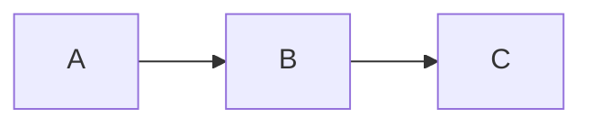

# docs-template

ProperDocs base repo for ICIQ-DMP project documentation.  
Fork this repo to create `PROJECT-docs` for any ICIQ project.

## Forking checklist

1. Fork this repo to `ICIQ-DMP/PROJECT-docs`.
2. **Enable GitHub Actions for the fork**: open the new fork's **Actions**
   tab in a browser and click **"I understand my workflows, go ahead and
   enable them."** GitHub disables Actions on every fork by default, and
   there's no error or failed run to notice if you skip this — the
   `docs.yml` workflow just silently never triggers on push, and no API/CLI
   can do this step for you. Do this **before** anything else below; it's
   exactly what left `imarina-load-researchers-docs` unpublished for
   months, because this step was missed.
3. In `properdocs.yml`, update the **PROJECT-SPECIFIC** block at the top:
   - `site_name`, `site_url`, `repo_url`, `repo_name`
   - `extra.source_repo` — the GitHub repo containing the source code
   - `extra.project_name`
4. Edit `docs/index.md` with the project description.
5. Enable GitHub Pages in the repo settings (source: **GitHub Actions**) —
   or call `POST /repos/ICIQ-DMP/PROJECT-docs/pages` with
   `{"build_type": "workflow"}`, which does the same thing.
6. Push to `main`/`master` — the `docs.yml` workflow will build, lint and
   deploy.

## Syncing template changes

Use GitHub's **Sync fork** button (or `git merge upstream/master` locally).  
The only expected conflict is the PROJECT-SPECIFIC block at the top of `properdocs.yml`.

## Structure

```
docs/
├── index.md            # Home page
├── tutorials/          # Learning-oriented content (write by hand)
├── how-to/             # Task-oriented content (write by hand)
├── reference/          # Auto-generated from source docstrings
├── explanation/        # Understanding-oriented content (write by hand)
└── gen_ref_pages.py    # mkdocs-gen-files script for reference generation
properdocs.yml
requirements.txt
.github/workflows/
└── docs.yml            # Build, lint (markdownlint) + deploy to GitHub Pages
```

## Local development

**With Docker (recommended):**

```bash
git clone https://github.com/iciq-dmp/PROJECT_NAME source
docker compose up
```

Open <http://localhost:8000>.

**Without Docker:**

```bash
pip install -r requirements.txt
git clone https://github.com/iciq-dmp/PROJECT_NAME source
properdocs serve
```

## Theme overrides

Place custom Jinja2 templates in `docs/overrides/` to extend or replace
Material for MkDocs partials. `docs/overrides/main.html` is included as a
starting point — it simply extends the base template.

## Mermaid diagrams

Use fenced code blocks tagged `mermaid`:

````markdown

```mermaid
graph LR
    A --> B --> C
```
````

## Redirects

To redirect a moved page, add entries to the `redirects.redirect_maps` block in
`properdocs.yml`:

```yaml
plugins:
  - redirects:
      redirect_maps:
        'old/page.md': 'new/page.md'
```
